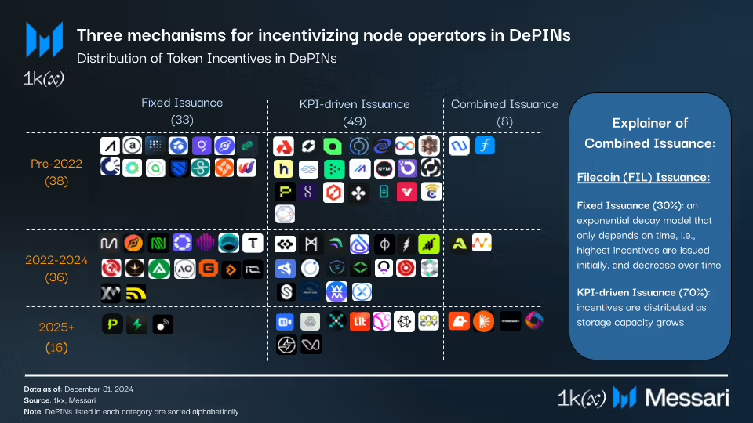

### Tokenomics of DePINs

So far there have been three parts of analysis:

1) A general overview on tokenomics approaches, introducing the three types of reward emission schedules: https://messari.io/report/depin-tokenomics-part-1-token-distribution-models-incentive-mechanisms-token-trends-and-more

2) The original [paper](https://github.com/1kx-network/web3infrastructure_tokenomics/blob/main/SoK%20Token%20economics%20of%20Web3%20infrastructure%20networks%20-%20Part%20I.pdf) that explored above classification in more depth. It's focused on network level rewards to incentivize the supply-side of DePINs. An article format summarizing it is here: https://mirror.xyz/1kx.eth/YWTZJO853QePwPUPka1aG4HXDT6hvqKnunG7fDe06Yg

The updated version of the quantitative analysis is [here](https://messari.io/report/depin-tokenomics-part-2-finding-the-right-balance-for-depin-token-rewards). 

3) Subsequent analysis focused on the cost side of DePINs. The approach is presented [here](https://mirror.xyz/0x91e2E2D26076C8A1EaDb69273605c16ef01928ce/-hPkroyM7PWIlXWQ8UhNhcFECfP1VsfE5-lY6Afp45s). 

Case studies for different DePINs using this framework are [here](https://mirror.xyz/0x91e2E2D26076C8A1EaDb69273605c16ef01928ce/-hPkroyM7PWIlXWQ8UhNhcFECfP1VsfE5-lY6Afp45s). These are based on various deep dives with node operator communities, notably
    - With Pocket network, shared in [their forum](https://forum.pokt.network/t/node-operator-survey/4572/4) (data in the Pocket folder of this repo as well).
    - With Livepeer, shared [here](https://forum.livepeer.org/t/node-operator-survey/2114)

Each analysed network has a folder with more information about sources and data used for the analysis (plus some additional data beyond what is covered in the paper/articles). There is also a googlesheet with overview of used datapoints for the articles [here](https://docs.google.com/spreadsheets/d/1MD7-3JIa7UqcS5kkebUi3WtXob7Dqj_85lW-POaMOV0/edit?gid=0#gid=0).

We will continuously update those folders as we continue the research around further aspects of tokenomics. Feel free to reach out to @KoschigRobert on Twitter for questions and comments.
